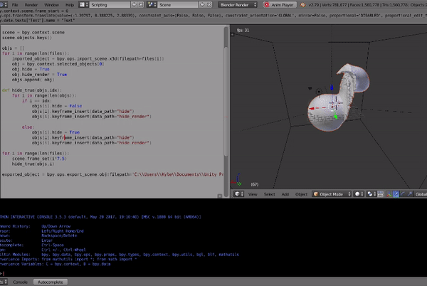

# Planetary-Collision-VR
Immersive 3D visualizations of planetary collisions using smoothed particle hydrodynamics and virtual reality. 


This project is supported by the University of Arizona/GPSC research grant, "Virtual Reality Gives New Insights Into How Planets Form"

## Getting started with Unity
1. Import our [Unity Package](https://drive.google.com/file/d/16RV8RiZHvaY7cy8e_RRx_m3EnEvnhdvy/view?usp=sharing)
2. Import [SteamVR plugin](https://assetstore.unity.com/packages/tools/integration/steamvr-plugin-32647) from Asset Store
3. Make sure HTC Vive is plugged in and SteamVR is on stand by
4. Open "DemoScene" and hit Play

All code was tested with Unity v2018.3.10

## Converting [Paraview](https://www.paraview.org/) Models with [Blender](https://www.blender.org/) (.x3d -> .obj)

1. Open Blender (v2.79)
2. Navigate to script editor (crtl+right arrow)x3
3. Open new script. Press button "+ New"
4. Delete the square model, if present
5. Paste code below 
```python
import bpy
import glob 

file_loc = "C:\\Users\\Kyle\\Documents\\SPH_objects\\"
files = glob.glob(file_loc+"*.x3d")
for i in range(len(files)):

    imported_object = bpy.ops.import_scene.x3d(filepath=files[i])
    obj = bpy.context.selected_objects[0]
    exported_object = bpy.ops.export_scene.obj(filepath=files[i].split('.x3d')[0]+'.obj')

    print('Imported name: ', obj.name)
    bpy.data.objects[obj.name].select = True   
    bpy.ops.object.delete()
    
```
Make sure to change the file location

## Creating an animation from multiple obj files in Blender 
```python
# https://docs.blender.org/api/2.79b/info_quickstart.html
import bpy
import glob 

file_loc = "C:\\Users\\Kyle\\Documents\\Unity Projects\\SPH_Visualization\\Assets\\models\\"
files = glob.glob(file_loc+"*.x3d")

scene = bpy.context.scene
scene.objects.keys()
bpy.context.scene.render.fps = 5
bpy.context.scene.frame_start = 0
bpy.context.scene.frame_end = len(files)

objs = [] 
for i in range(len(files)):
    imported_object = bpy.ops.import_scene.x3d(filepath=files[i])
    obj = bpy.context.selected_objects[0]
    obj.hide = True
    modifier=obj.modifiers.new('Decimate 0.5','DECIMATE')
    modifier.ratio=0.5
    modifier.use_collapse_triangulate=True
    objs.append( obj)

def hide_true(objs,idx):
    for i in range(len(objs)):
        if i == idx:
            objs[i].hide = False
            objs[i].keyframe_insert(data_path="hide")
        else:
            objs[i].hide = True
            objs[i].keyframe_insert(data_path="hide")

for i in range(len(files)):
    scene.frame_set(i)    
    hide_true(objs,i)

for k in range(len(bpy.data.objects)-1,0,-1):
    if 'Face' not in bpy.data.objects[k].name:
        bpy.data.objects[k].select = True
    else: 
        bpy.data.objects[k].select = False 

bpy.ops.object.delete()
```


